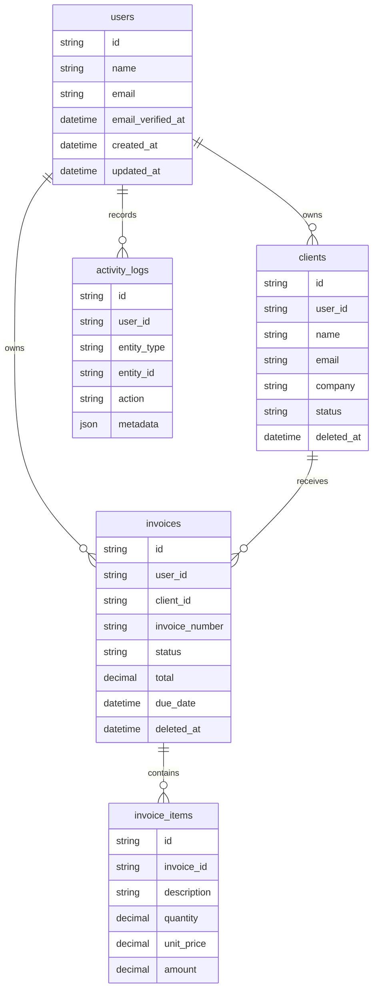

# Architecture

InvoiceLoop is a single Next.js application with server-rendered pages, typed server actions, Prisma, and a relational database. The app keeps the product surface small: clients, invoices, dashboard metrics, and activity logs.

## Data Relationships

## Auth And Authorization

Production auth should be handled by Supabase Auth or Auth.js instead of hand-rolled crypto. Dashboard routes are protected server-side, and every mutation checks that the current user owns the target row before writing.

## Key Decisions

- Keep the domain narrow so the app feels finished rather than oversized.
- Use a relational schema because invoices and clients have clear relationships.
- Build the dashboard around payment collection health, not generic charts.
- Store activity logs immutably so reviewers can see auditability and real product thinking.
