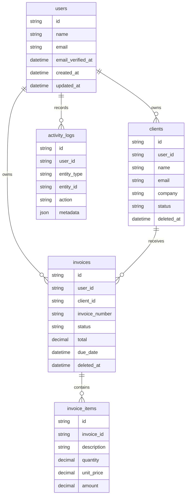

# Architecture

InvoiceLoop is a single Next.js application with server-rendered pages, typed server actions, Prisma, and a relational database. The app keeps the product surface small: clients, invoices, dashboard metrics, and activity logs.

## Data Relationships

## Auth And Authorization

The local trial build uses a seeded demo user, a scrypt-hashed password, server-created sessions, and an httpOnly SameSite=Lax cookie. Dashboard routes call `requireUser()` server-side before rendering. A production version should add email verification, password reset, rate limiting, and row-level ownership checks before multi-tenant launch.

## Key Decisions

- Keep the domain narrow so the app feels finished rather than oversized.
- Use a relational schema because invoices and clients have clear relationships.
- Keep session tokens hashed in the database and store the raw token only in an httpOnly cookie.
- Build the dashboard around payment collection health, not generic charts.
- Store activity logs immutably so reviewers can see auditability and real product thinking.
